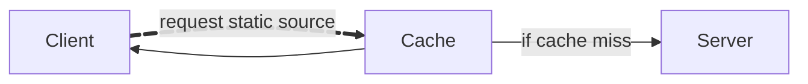

# WEB CACHE DECEPTION

## TABLE OF CONTENT

## Fundamental knowledge

### Web caches

**Cache miss**: If the cache doesn't contain a copy of the resource, the request is forwarded to the origin server, which processes and responds to the request.

**Cache hit**: When a request for the same static resource is made in the future, the cache serves the stored copy of the response directly to the user. 

Caching has become a common and crucial aspect of delivering web content, particularly with the widespread use of Content Delivery Networks (CDNs), which use caching to store copies of content on distributed servers all over the world. CDNs speed up delivery by serving content from the server closest to the user, reducing load times by minimizing the distance data travels. 

### Cache keys

When the cache receives an HTTP request, it must decide whether there is a cached response that it can serve directly, or whether it has to forward the request to the origin server.

The cache makes this decision by generating a **cache key** from elements of the HTTP request. Typically, this includes the <ins>URL path</ins> and <ins>query parameters</ins> (and some other elements like <ins>headers</ins> and <ins>content type</ins>)

### Cache rules

Cache rules determine what can be cached and for how long.

Static resources can be cached, not the dynamic content for the sensitive information, ensuring users get the latest data directly from server.

- Static file extentsion rules: match the file extension, of the requested resourse. Eg: `.css`, `.js`
- Static directory rules: match all URL pahts starting with a specific prefix (static resources). Eg: `/static`, `/assets`
- File name rules: match specific file names to target fies that are universally required for web operations (and change rarely). Eg: `robots.txt`, `favicon.ico`
- URL parameters
- Dynamic analysis

## Attack

General steps:
1. Identify a target endpoint that returns a dynamic response containing sensitive information.
   - Review responses in Burp
   - Focus on endpoints supporting `GET`, `HEAD`, `OPTIONS` methods
2. Identify a discrepancy in how the cache and origin server parse the URL path.
   - Map URLs to resources
   - Process delimiter characters
   - Normalize paths
 3. Craft a malicious URL that uses the discrepancy to trick the cache into storing a dynamic response.

> [!TIP]
> Automation using *Param Miner* extension by Param mine > Settings > Add dynamic cachebuster. You can view added query strings in the Logger tab.

### Cached responses
- `X-Cache: hit`: response was served from the cache
- `X-Cache: miss`: cache did not contain a response for the request's key
- `X-Cache: dynamic`: origin server dynamically generated the content (generally not suitable for caching)
- `X-Cache: refresh`
- `Cache-Control`: cached content was outdated and needed to be refreshed or revalidated

> [!TIP]
> Time is the big factor

### Path mapping discrepancies

#### URL Style

1. Traditional style: direct file system. Eg: `http://example.com/path/in/filesystem/resource.html`, `/page.php?id=202&date=07112012`
2. REST-style: abstract file path into logical parts of API. Eg: `http://example.com/path/resource/param1/param2`, `/page/202/07112012/` (`/{page}/{id}/{data}`)

### Interpretation

Example: `http://example.com/user/123/profile/wcd.css`

1. Traditional style: request for `wcd.css`, will serve profile info if request were a CSS file.
2. REST-style: request for `/user/123/profile` endpoint, return profile info for user `123`, ignore `wcd.css` (non-significatn param)

### Delimiter discrepancies

### Delimiter decoding discrepancies

### Static directory cache rules

### Normalization discrepancies

### Filename cache rules

## Prevention

# WEB CACHE POISONING
